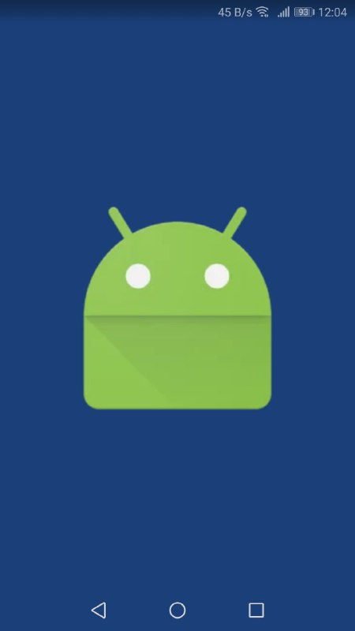
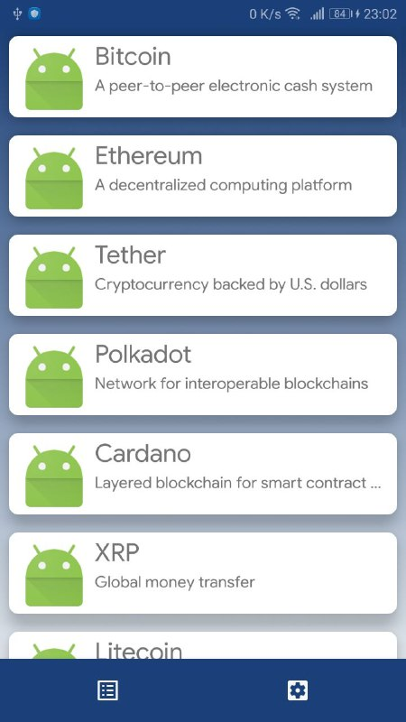
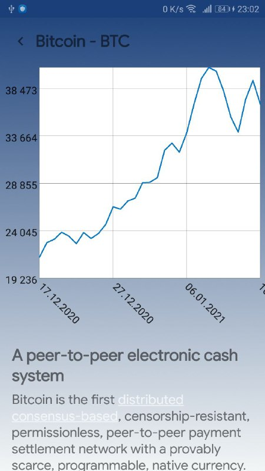

### Sample Android app based on:

1. MVVM (AndroidX ViewModel, LiveData)
2. Repository based on Coroutines Flow and suspend functions
3. Koin DI
4. Common module with logger and custom util
5. Dependency versions in versions.gradle
6. RecyclerView with Paged adapter and item animator in gallery feature
6. CoordinatorLayout and Toolbar in page feature
7. Splash screen with logo when app is starting
8. https://messari.io/ as backend for load crypto assets

<table>
  <tr>
    <td></td>
    <td></td>
    <td></td>
  </tr>
</table>